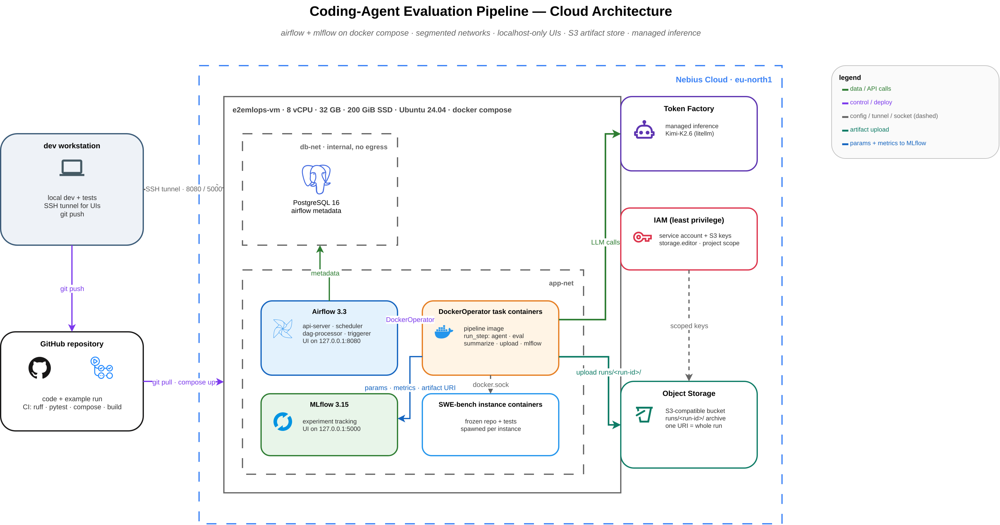
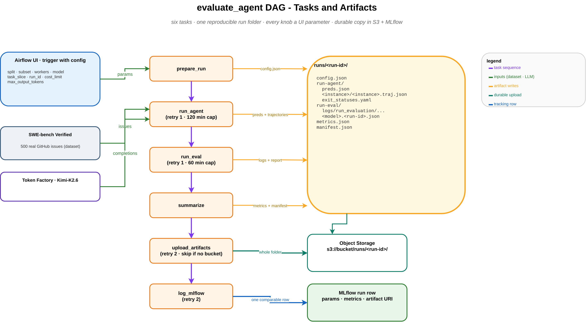
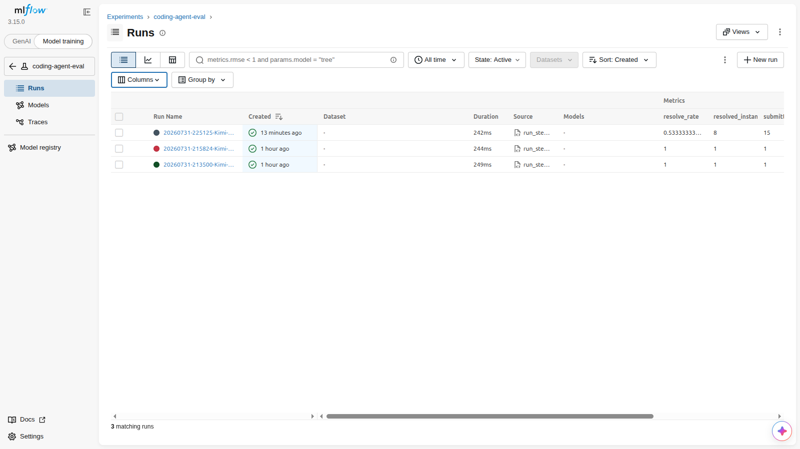
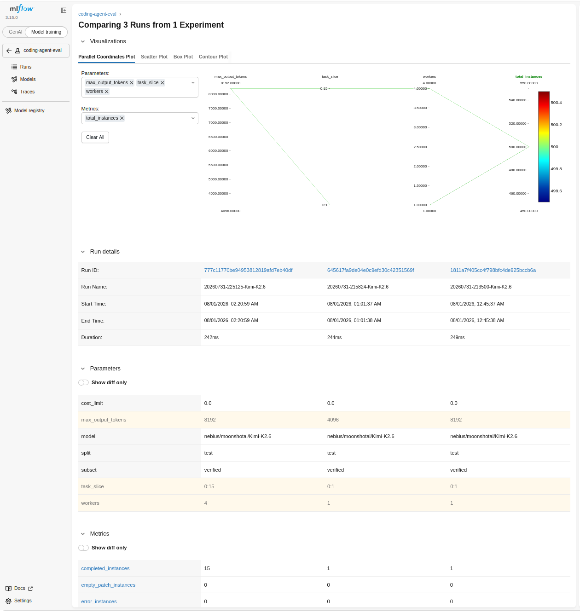
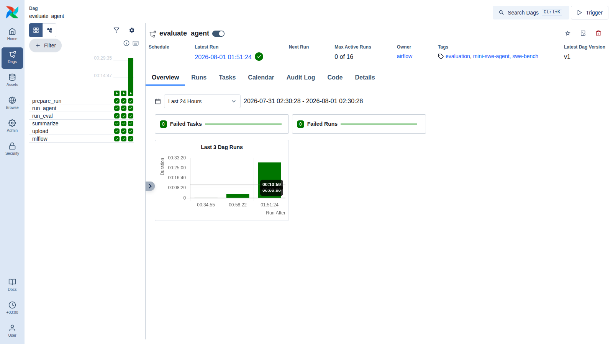

# Report: an Airflow evaluation pipeline for coding agents

This is the full writeup of my solution to the "End-to-end ML pipeline" assignment: turning the
provided ad-hoc mini-swe-agent and SWE-bench scripts into a parameterized Airflow pipeline with a
durable artifact trail, MLflow tracking, Docker-isolated execution, and a docker compose
deployment on a Nebius VM. Everything below happened on 2026-07-31, and every number comes from a
committed file or a screenshot in this repo.

## 1. Architecture



<sub>Diagram source: [`diagrams/architecture-overview.drawio`](diagrams/architecture-overview.drawio). Export to PNG from the drawio editor to refresh.</sub>

The pipeline is one DAG, [`dags/evaluate_agent.py`](dags/evaluate_agent.py), with six tasks:

```
prepare_run -> run_agent -> run_eval -> summarize -> upload_artifacts -> log_mlflow
```

Every task after `prepare_run` executes the same command, `python -m pipeline.run_step <step>
<run_dir>`, through one of two isolation levels selected by the `EXECUTION_MODE` environment
variable:

- `local`: a subprocess in the project venv, for `airflow standalone` during development.
- `docker`: a `DockerOperator` container from the project image, for the compose deployment.

One code path, two isolation levels, so nothing I tested locally had to be rewritten for
production. The path rebasing in [`pipeline/run_step.py`](pipeline/run_step.py) makes a run folder
created on the host work identically inside a container mounted at `/opt/project`.



<sub>Diagram source: [`diagrams/pipeline-flow.drawio`](diagrams/pipeline-flow.drawio).</sub>

The compose deployment ([`docker-compose.yaml`](docker-compose.yaml)) runs Airflow 3.3
(api-server, scheduler, dag-processor, triggerer), PostgreSQL 16, and MLflow 3.15 with two
segmented networks:

| Network | Members | Exposure |
|---|---|---|
| `db-net` (internal, no egress) | PostgreSQL + the Airflow services that query it | nothing published |
| `app-net` | MLflow, Airflow services, DockerOperator task containers | UIs on `127.0.0.1` only |

No UI is reachable from the internet. Access is through an SSH tunnel:
`ssh -L 8080:localhost:8080 -L 5000:localhost:5000 <user>@<vm>`.

## 2. How to trigger a run

From the Airflow UI (Trigger DAG w/ config), every experiment knob is a form field. Nothing about
the experiment is hardcoded:

| Param | Default | Meaning |
|---|---|---|
| `split` | `test` | dataset split |
| `subset` | `verified` | SWE-bench subset (enum: verified, lite, full) |
| `workers` | 1 | parallel workers for both the agent and the evaluation |
| `model` | `nebius/moonshotai/Kimi-K2.6` | litellm model name |
| `task_slice` | `0:1` | instance slice; empty runs the whole subset |
| `run_id` | auto | explicit ID reruns into the same folder |
| `cost_limit` | 0 | per-instance USD limit, 0 disables |
| `max_output_tokens` | 8192 | model output budget per step (see section 6) |

Rerunning by `run_id` is idempotent: the run directory is reused and mini-swe-agent skips
instances that already have trajectories, so a crashed batch resumes instead of restarting.

Retry policy per step, chosen deliberately: `run_agent` 1 retry with a 120 minute timeout (safe
because reruns skip finished instances), `run_eval` 1 retry at 60 minutes, `upload_artifacts` and
`log_mlflow` 2 retries each since they are short network calls. The retries were exercised for
real during deployment (section 7).

## 3. Artifact layout

Each run writes a self-contained folder:

```
runs/<run-id>/
  config.json          # the resolved parameters, written before anything runs
  run-agent/
    preds.json         # instance_id -> model patch
    <instance>/<instance>.traj.json   # full agent conversation
    exit_statuses_*.yaml
    minisweagent.log
  run-eval/
    logs/run_evaluation/<run-id>/...  # per-instance eval.sh, patch, test output
    <model>.<run-id>.json             # the harness summary report
  metrics.json         # flat metrics parsed from the report
  manifest.json        # file inventory with sizes + the artifact URI
```

Two run folders are committed as evidence: the first resolved single-instance run
([`runs/20260731-185127-Kimi-K2.6/`](runs/20260731-185127-Kimi-K2.6/), complete) and the key
files of the 15-instance showcase run
([`runs/20260731-225125-Kimi-K2.6/`](runs/20260731-225125-Kimi-K2.6/)).

`upload_artifacts` pushed every run folder to S3-compatible Nebius Object Storage
(`s3://carmit-e2emlops-runs/runs/<run-id>/`, 123 objects, 24 MiB across three production runs),
with the URI recorded in `manifest.json` and tagged in MLflow. The screenshots in
[`screenshots/`](screenshots/) show the bucket contents. After the assignment run was complete I
archived all run folders into the repo and deleted the bucket along with the VM, the service
account, and its keys; the pipeline recreates all of it from `.env` values on any fresh
deployment. The step skips itself with a printed reason when `S3_BUCKET` is unset, so the
pipeline also works in local-only setups.

## 4. MLflow tracking

`log_mlflow` records one comparable row per run: all 7 parameters, all 8 metrics from
`metrics.json`, and the artifact URI as a tag. Config, metrics, and manifest are attached as
MLflow artifacts.

The production MLflow held three rows:

| run | task_slice | workers | max_output_tokens | submitted | resolved | resolve_rate |
|---|---|---|---|---|---|---|
| `20260731-213500` | 0:1 | 1 | 8192 | 1 | 1 | 1.00 |
| `20260731-215824` | 0:1 | 1 | 4096 | 1 | 1 | 1.00 |
| `20260731-225125` | 0:15 | 4 | 8192 | 15 | 8 | 0.533 |




## 5. The runs, all of them

I kept every run folder, including the failures, because the failures are where the pipeline
proved itself:

| Run | Where | What happened |
|---|---|---|
| `20260731-182049` | laptop | first DAG run; the agent hit the 120 s container-start window while its 2.7 GB eval image was still downloading. Empty patch, honestly recorded: `submitted 1, empty_patch 1, resolved 0`. |
| `20260731-185127` | laptop | image cached; agent resolved astropy-12907 in 12 API calls. Its one-line patch is byte-identical to the instructor's sample. Committed in full. |
| `20260731-193321` | laptop | same instance at `max_output_tokens=4096`, also resolved. |
| `20260731-204900` | laptop | failed in seconds: my task parameter was named `run_id`, which Airflow reserves. The DAG's downstream tasks correctly went `upstream_failed`. |
| `20260731-205301` | laptop | the rebuilt 6-task pipeline end to end, resolved again, S3 step skipped itself (no bucket configured locally), MLflow row logged. |
| `20260731-213500` | VM | first DockerOperator run. Five tasks green; `log_mlflow` failed 3 times (its retries firing exactly on schedule) against MLflow's DNS-rebinding guard, then succeeded after the fix. |
| `20260731-215824` | VM | 4096-token comparison run, clean. |
| `20260731-225125` | VM | the showcase: 15 instances, 4 workers. |

The showcase run in detail: all 15 episodes ended in `Submitted`, all 15 patches applied, zero
errors, zero empty patches. 8 of 15 resolved (53.3%): astropy 12907, 13236, 13453, 13579, 14096,
14309, 14508, 14539. The 7 misses all follow the same pattern: the agent believed its fix and the
project's test suite disagreed. Timing: 25 minutes for the agent phase, 4.6 minutes for all 15
evaluations at 4 workers, under 10 seconds for summarize, the 97-file S3 upload, and the MLflow
row. 29.5 minutes end to end.



## 6. The max_output_tokens investigation

My first two agent episodes both died with `exit_status: RepeatedFormatError` and no patch: the
model kept hitting an output-token ceiling mid-reasoning (`finish_reason=length`) before emitting
the bash command mini-swe-agent expects, and after three consecutive cutoffs the harness gives up.
The instructor's own sample data shows the same failure: three of his four batch attempts ended
with every instance in `RepeatedFormatError`.

The default SWE-bench agent config sets no token limit at all, so the provider default applies.
The fix is one config override, passed by the DAG on every run and exposed as a UI parameter:

```
-c model.model_kwargs.max_tokens=<max_output_tokens>
```

The evidence across everything I can count:

| Configuration | Episodes | Submitted a patch |
|---|---|---|
| no explicit limit (my 2 sanity runs + the instructor's 3 sample batches) | 11 | 0 |
| explicit limit, 4096 or 8192 | 19 | 19 |

Same model, same harness, same benchmark. This one line is the single biggest quality lever in
the project, and both budgets I tried (4096 and 8192) resolved the probe instance, so the exact
value matters less than setting one at all.

## 7. What broke during deployment, and the fixes

Every one of these is a real failure from this build, with the fix in git history:

1. **The 120 second image-pull race.** mini-swe-agent gives a container 120 seconds to start, and
   a first-ever SWE-bench image pull (2.5 to 2.7 GB) can exceed it on a home uplink. On the VM's
   datacenter network it never recurred. The task-level retry also covers it: the second attempt
   finds the image cached.
2. **`run_id` is a reserved Airflow context key.** Naming a task function parameter `run_id`
   fails at runtime with "The key 'run_id' in args is a part of kwargs and therefore reserved".
   Renamed to `run_ref`.
3. **The official Airflow image and arbitrary UIDs.** My hand-rolled `airflow-init` bypassed the
   image's `/entrypoint`, and with `AIRFLOW_UID=1001` Python could not find the airflow package
   (`ModuleNotFoundError`). The upstream pattern is a root init container that delegates to
   `/entrypoint` with `_AIRFLOW_DB_MIGRATE` and `_AIRFLOW_WWW_USER_CREATE` flags.
4. **The entrypoint refuses pip as root.** `_PIP_ADDITIONAL_REQUIREMENTS` (which installs the
   Docker provider in the service containers) makes a root init container exit 1. Init does not
   need the provider, so it blanks the variable.
5. **MLflow 3 ships DNS-rebinding protection.** Task containers calling `http://mlflow:5000` got
   403 "Invalid Host header - possible DNS rebinding attack detected". Fixed with
   `--allowed-hosts "mlflow:5000,localhost:5000,127.0.0.1:5000"`. The guard also correctly
   rejected a mis-ported tunnel of mine later, which is the behavior you want from it.

## 8. Security choices

- Segmented compose networks: the database network is `internal: true` and holds only PostgreSQL
  and the Airflow services that query it. Nothing else can even route to it.
- Both UIs bind to `127.0.0.1` on the VM and are reached exclusively through an SSH tunnel. No
  allowlists to rot, nothing exposed on the public IP.
- The S3 credentials belong to a dedicated service account whose only permission is
  `storage.editor` scoped to the one project, granted through a dedicated IAM group rather than
  the tenant-wide editors group.
- The storage variables are named `S3_*`, not `AWS_*`, and the uploader passes them to boto3
  explicitly. Nebius Object Storage speaks the S3 protocol; nothing here touches AWS, and the
  naming should not suggest otherwise.
- `.env` is git-ignored and docker-ignored. The compose file refuses to start without its
  required secrets (`:?` guards) instead of falling back to defaults.
- Known trade-offs, accepted consciously: task containers run as root with the Docker socket
  mounted (both the agent and the harness spawn sibling exam containers; the production-scale
  answer is `KubernetesPodOperator`), and credentials pass through container environment
  variables (the production answer is a secrets backend).

## 9. Cost and lifecycle

The whole cloud footprint existed for about three hours on 2026-07-31: one 8 vCPU / 32 GB VM with
a 200 GiB disk, one 24 MiB bucket, one service account with one key. All of it was deleted the
same night after the artifacts were archived into this repo, verified empty by listing every
resource type. The single largest line item was the model API usage for 21 agent episodes.

## 10. What I would do with more time

- `KubernetesPodOperator` instead of DockerOperator, which removes the socket mount and the
  root-container trade-off in one move.
- A Langfuse layer on the agent conversations. MLflow answers "which config scored what"; the
  trajectory files hold the "what did the model actually do" data and deserve trace tooling.
- A second model column in MLflow. The pipeline takes `model` as a parameter already; comparing
  Kimi against a Qwen or Llama variant on the same 15 instances is one form entry per model.
- Dataset and image caching. The 15 evaluation images cost about 40 GB of pulls on first run;
  a pre-pull step or a registry mirror would make cold runs as fast as warm ones.
